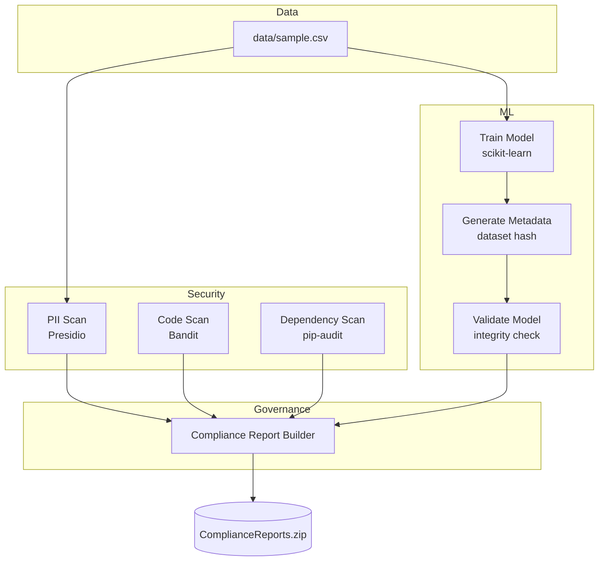

# Secure MLOps Pipeline · AI Governance · DevSecOps for ML · Automated Compliance

A fully automated Secure MLOps pipeline demonstrating how to integrate security, governance, and compliance into the AI/ML lifecycle.  
Built as a practical extension of the AIOps: Security & Governance learning path.

This project runs a complete AI security workflow using GitHub Actions — from PII scanning to model integrity validation.

---

## Key Highlights

### Security Automation
- PII detection (Microsoft Presidio)  
- Static code analysis (Bandit)  
- Dependency vulnerability audit (pip-audit)

### MLOps Integration
- Automated model training  
- Metadata generation (version, timestamp, dataset hash)  
- Dataset integrity validation using SHA-256

### Governance & Reporting
- Unified compliance report  
- All artifacts stored for audit trails  
- Pipeline automatically fails on security violations  

---

## Why This Project Matters

Modern AI systems must meet:

- Data protection laws  
- Internal governance policies  
- Security requirements  
- Audit readiness  

This pipeline demonstrates **enterprise-grade AIOps workflows**, making it a strong reference for:

- DevOps / MLOps engineers  
- Data platform teams  
- AI governance practitioners  
- Cloud engineers expanding into AIOps  

---
## Architecture — High-Level Security + MLOps Flow

---

## Pipeline Artifacts

The CI workflow produces the following output files:

| Artifact                | Purpose                                  |
|------------------------|-------------------------------------------|
| `pii_scan.txt`         | Sensitive data findings                   |
| `bandit_report.txt`    | Static code vulnerabilities               |
| `dependency_report.md` | Dependency CVE audit                      |
| `model_validation.txt` | Dataset hash + metadata checks            |
| `compliance_report.md` | Final unified governance/security report  |

---

## How to Run Locally

pip install -r requirements.txt

## Train ML model
python model/train.py

## Run PII scan
python security_scans/scan_pii.py data/sample.csv

## Validate dataset + model integrity
python security_scans/validate_model.py

## GitHub Actions Workflow (CI)

Triggered automatically on every push to the main branch.
Workflow file is located at:

.github/workflows/ci.yml

## CI Steps

1. Set up Python
2. Install dependencies
3. Run PII scan
4. Run Bandit static code analysis
5. Run pip-audit dependency check
6. Train ML model
7. Validate dataset + model integrity
8. Generate unified compliance report
9. Upload artifacts to GitHub

## License

MIT License — open for reuse and adaptation.

